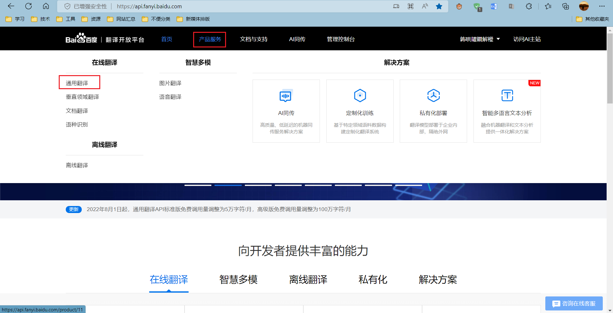
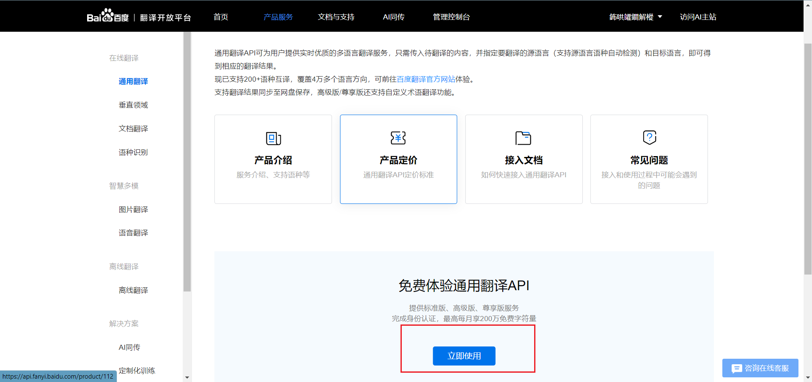
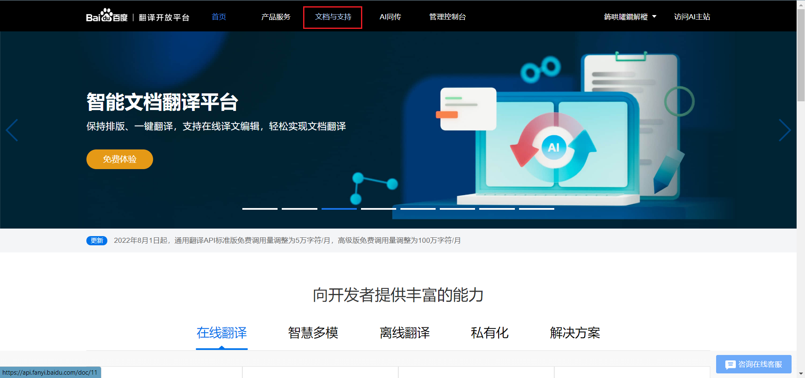
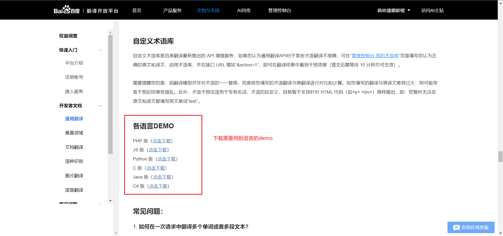
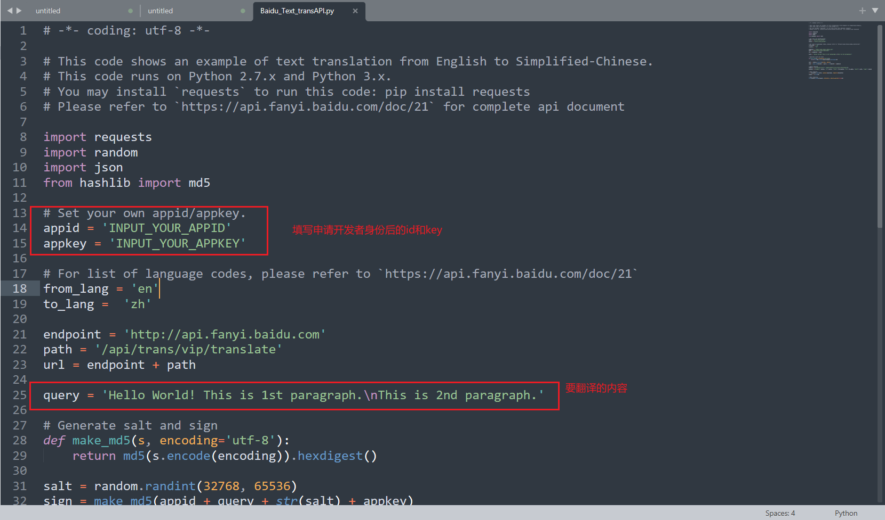
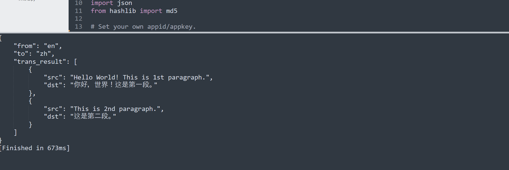

---

title: 百度翻译API接口调用-Python语言
date: 2022-10-08 17:29:26
tags:

---

# 百度翻译API接口调用-Python语言

## :one:申请百度翻译开放平台个人开发者

网页地址：[百度翻译开放平台 (baidu.com)](https://api.fanyi.baidu.com/)

### 1.点击产品服务，选择通用翻译

### 2.选择免费体验通用翻译API

### 3.填写对应信息申请使用

## :two:使用官方提供demo

### 1.参考开发文档

通用翻译开发者文档：[百度翻译开放平台 (baidu.com)](https://api.fanyi.baidu.com/doc/21)

开发文档有详尽的开发内容，可以通过下载使用demo完成快速开发使用

### 2.下载需要用到的demo

## :three:完成测试-以Python为例

### 1.填写开发者信息

### 2.测试

## 注意

其他代码可以自行根据开发文档自行查看。
